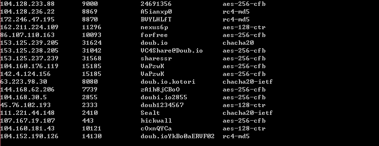
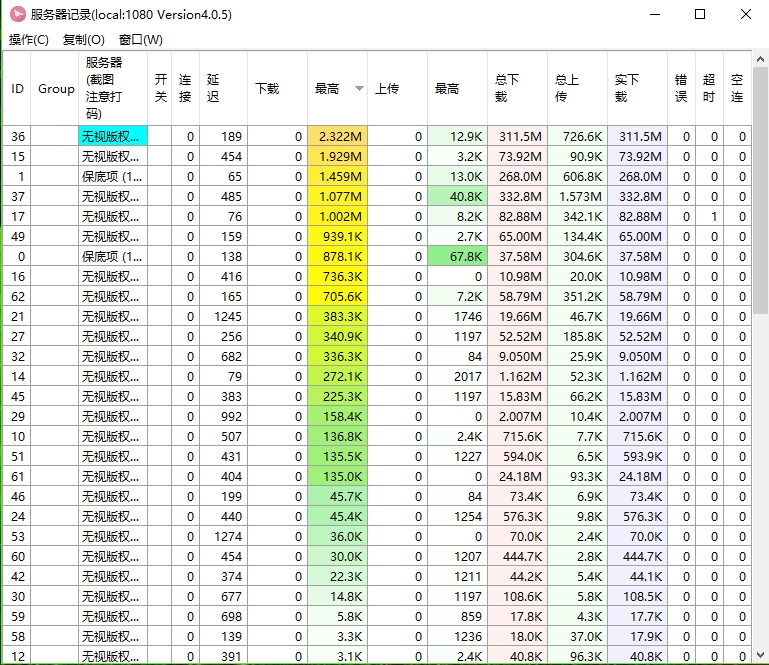

# AutoGetSs
### 介绍

~~没钱、没钱、没钱~~。

### 需求

- [x] 获取网站[doub.io](https://doub.io/sszhfx/),[frss.ml](http://frss.ml/),[vpsml](http://ss.vpsml.site/),[isx](http://isx.yt/)
- [ ] 调试日志
- [x] 不和原有配置发生冲突
- [ ] 多系统支持
- [ ] 自动运行

### 效果




### install
[ShadowsocksR使用详解](https://doub.io/ss-jc10/)

#### Windows(源码)

1. 你需要安装python2.7，[下载地址](https://www.python.org/)

2. 需要安装chardet,lxml和requests模块，在管理员终端运行如下命令

   ```cmd
   py -2 -m pip install futures
   py -2 -m pip install requests
   py -2 -m pip install chardet
   py -2 -m pip install lxml
   ```

3. 将Auto_Ssx.x.x.py放在ShadowsocksR文件夹内

4. 需要ShadowsocksR文件夹内有gui-config.json文件

5. 在管理员终端运行如下命令，需要打开全局代理。
    ```cmd
    py -2 Auto_Ssx.x.x.py
    ```

#### Windows(exe)

1. 下载Auto_Ss0.1.2.exe到ShadowsocksR文件夹

2. 管理员运行Auto_Ss0.1.2.exe,需要打开全局代理。

3. ShadowsocksR更新加载gui-config.json文件

###注意: 在加载的过程中有什么任何错误提示，都可以打开ShadowsocksR全局代理。管理员运行Auto_Ss0.1.2.exe **多次**
